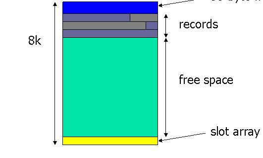
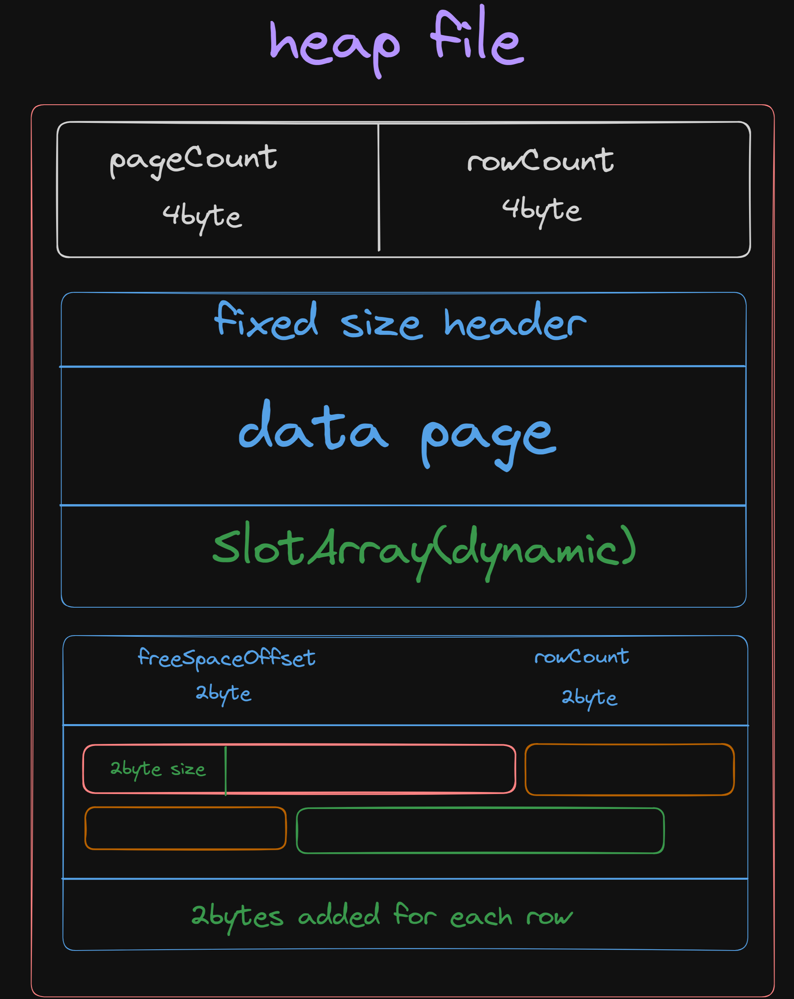

# HeapManager

The `HeapManager` is the package that manages the heap of each table in the database. It is responsible for allocating and freeing space for the table's records in the disk. It also provides a way to access the records in the heap.

## Heap Structure

heap is a collection of pages. Each page is a collection of records. Each record is a collection of fields.

### HeapHeader

The heap header contains the following information:

```
|  HeapID   | PageCount | RowCount |
|    4B     |    4B     |    4B    |
```

## Page Structure



### PageHeader

- usually 96 bytes long contains some common required fields like:
  - **PageId**
    identifier of the page number in the heap file.
  - **PageType**
    type of the page, it can be:
    - **DataPage**
      contains records
    - **IndexPage**
      contains index entries
    - **HeaderPage**
      contains the heap header
  - **PageSize**
    the size of the page in bytes usually 8KB similiar to postgres and mysql.
  - **pageoffset**
    the offset of the page in the heap file.
  - **NextPageId**
    the identifier of the next page in the heap file.
  - **PrevPageId**
    the identifier of the previous page in the heap file.
  - **FreeSpace**
    the amount of free space in the page.
  - **RecordCount/slotCount**
    the number of records in the page.
  - **FreeSpaceOffset**
    the offset of the first free byte in the page.
  - **DataOffset(useless if it fixed accros all pages)**
    the offset of the first record in the page.
  - **slotArrayOffset((useless if it is in fixed offset accros all pages)**
    the offset of the slot array in the page.
  - **Timestamps**
    - CreationTimestamp
    - LastUpdateTimestamp
    - LastAccessTimestamp
  - **Checksum(not necessary)**
    a checksum to verify the integrity of the page.

### Record Structure

- **RecordHeader**
  - **RecordId**
    the identifier of the record in the page.
  - **RecordSize**
    the size of the record in bytes.
  - **FieldCount**
    the number of fields in the record.
  - **FieldOffset(useless if it fixed accros all records)**
    the offset of the first field in the record.
  - **Timestamps**
    - CreationTimestamp
    - LastUpdateTimestamp
    - LastAccessTimestamp

### slotArray

- an array of slots, each slot contains the following fields:
  - **RecordId**
    the identifier of the record in the page.
  - **RecordOffset**
    the offset of the record in the page.
  - **RecordSize**
    the size of the record in bytes.

## HeapManager API

HeapManager deals with binary data, so it provides a set of functions to read and write binary data to the disk. so all the functions are dealing with byte arrays, heap manager doesn't know anything about the data types of the fields. It's the responsibility of the higher layers to interpret the data.

as and example, the `InsertRow` function will take a byte slice as a parameter and it will write this byte slice to the heap.

the `GetRow` function will take an identifier and it will return a byte slice that contains the record data.

```go
package main
import (
    "encoding/binary"
    "fmt"
 )

func main () {
    // as example, row contains 2 integers
    x := 10
    y := 20
    row := make([]byte, 8)
    binary.LittleEndian.PutUint32(row, uint32(x))
    binary.LittleEndian.PutUint32(row[4:], uint32(y))

    //row is just a slice of bytes that contains the binary representation of the 2 integers

    // insert the row to the heap
    heapManager.InsertRow(row)

    // get the row from the heap
    result := heapManager.GetRow(1)
    fmt.Println(result) // [10 0 0 0 20 0 0 0]
}

```

## Heap file structure



## HeapManager Public Functions

- `CreateHeap(name string)`:

  - creates a new heap file with file name = name and initializes the heap header.

- `AddRowToHeap(name string , row []byte)`:

  - adds a new row to the heap with name.

- `GetRowFromHeap(name string, rowIndex int) []byte`:

  - returns the row with the given index from the heap with name.

- `GetPageFromHeap(name string, pageIndex int) [][]byte`:
  - returns all the records in the page with the given index from the heap with name.
